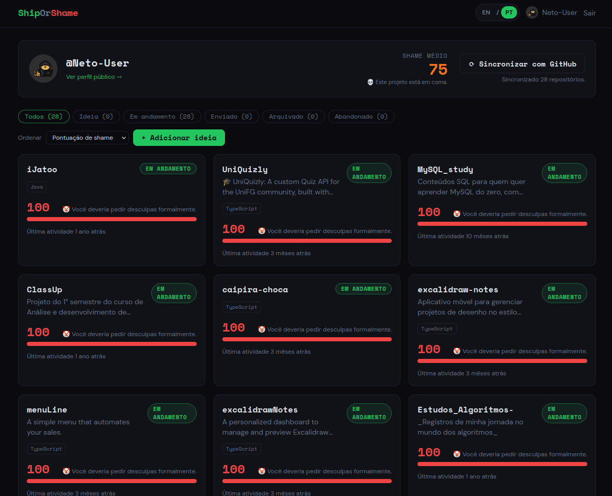

<div align="center">

# 🚢 ShipOrShame 🔥

**Stop lying to yourself about your side projects.**

[](#-leia-em-português) [](#-read-in-english)

</div>

---

<!-- ============================================= -->
<!-- ENGLISH -->
<!-- ============================================= -->

<a id="-read-in-english"></a>
<details open>
<summary><b>🇺🇸 Read in English (click to toggle)</b></summary>

<br>

ShipOrShame connects to your GitHub and publicly displays exactly how long you've been "almost done" with that app. It assigns every project a shame score and a roast label, then nudges you to either ship it or consciously archive it.

> 92% of developers abandon side projects within the first month. Are you the 8%?

[Features](#features) · [Self-Hosting](#self-hosting) · [GitHub OAuth Setup](#github-oauth-setup) · [Contributing](#contributing)

<p align="center">
  
</p>

### Features

- **GitHub sync** — pulls every repo, with creation date, last push, languages, topics, and homepage.
- **Shame score (0–100)** — a server-computed, brutally honest number based on how long an idea has been rotting, whether it's vaporware, and how stale the last commit is.
- **Roast labels** — from 🚀 *Shipped. Respect.* to 🤡 *You should be legally required to apologize.*
- **Idea tracking** — log pure ideas (no repo yet) with a start date and watch the shame accumulate.
- **Manual statuses** — mark a project `SHIPPED` and the shame drops to 0. Archive it and it's shame-free (intentional ≠ shameful).
- **Public profile** — a shareable `/u/your-username` page so the world can witness your backlog.
- **Embeddable JSON API** — `GET /api/shame/:username` with open CORS for badges and embeds.
- **Email nudges** — friendly-sarcastic reminders via Resend when a project goes stale (never more than 1 per project per 7 days).
- **Self-hostable** — Docker + docker-compose included. Your shame, your server.

### Shame Score Algorithm

```
Base = days since the idea was born (capped at 365)

Multipliers (compounding):
  IDEA with no repo            × 1.5   (pure vaporware)
  repo exists, never pushed    × 1.3
  last commit  > 90 days ago   × 1.2
  last commit  > 180 days ago  × 1.4
  IN_PROGRESS, idle 30+ days   × 1.2

Discounts / overrides:
  liveUrl set                  × 0.1   (you shipped, you legend)
  status SHIPPED               = 0
  status ARCHIVED / ABANDONED  = 0     (intentional = no shame)

Final = min(100, floor(base × multipliers × discounts))
```

| Score | Label |
|---|---|
| 0 | 🚀 Shipped. Respect. |
| 1–20 | 😊 Making moves |
| 21–40 | 🐢 Taking your time... |
| 41–60 | 😬 Oof. The vibes are off. |
| 61–80 | 💀 This project is in a coma. |
| 81–99 | ☠️ Digital graveyard. RIP. |
| 100 | 🤡 You should be legally required to apologize. |

### Tech Stack

SvelteKit + TypeScript · Tailwind CSS · PostgreSQL + Prisma · GitHub OAuth via Arctic · Octokit · Resend · pnpm.

### Self-Hosting

**Option A — Docker (recommended)**

This spins up Postgres and the app, runs migrations, and serves on port 3000.

```bash
git clone <your-fork-url> shiporshame && cd shiporshame
cp .env.example .env        # fill in GitHub + Resend + secrets (see below)
docker compose up --build
```

Open `http://localhost:3000`.

Generate the two secrets with:

```bash
openssl rand -hex 32   # SESSION_SECRET
openssl rand -hex 32   # CRON_SECRET
```

**Option B — Manual**

Requirements: Node 20+, pnpm, a PostgreSQL database.

```bash
pnpm install
cp .env.example .env        # fill in your values
pnpm db:generate            # generate the Prisma client
pnpm db:deploy              # apply migrations (or `pnpm db:push` for a quick start)
pnpm dev                    # http://localhost:5173
```

Production build:

```bash
pnpm build
node build                  # adapter-node server (respects $PORT)
```

### Environment Variables

See `.env.example`. All of them:

| Variable | Description |
|---|---|
| `DATABASE_URL` | PostgreSQL connection string. |
| `GITHUB_CLIENT_ID` | GitHub OAuth app client ID. |
| `GITHUB_CLIENT_SECRET` | GitHub OAuth app client secret. |
| `RESEND_API_KEY` | Resend API key (optional — nudges are logged if unset). |
| `RESEND_FROM_EMAIL` | Verified "from" address for nudge emails. |
| `SESSION_SECRET` | 32+ random bytes; signs sessions and derives the token AES key. |
| `PUBLIC_APP_URL` | Public base URL, no trailing slash (used for OAuth redirect). |
| `CRON_SECRET` | Bearer token required by `POST /api/cron/nudges`. |

### Scheduling Nudges

Point your platform's cron at the nudge endpoint once a day:

```bash
curl -X POST https://your-app.example.com/api/cron/nudges \
  -H "Authorization: Bearer $CRON_SECRET"
```

- **Vercel** — add a `vercel.json` cron entry hitting `/api/cron/nudges`.
- **Railway** — add a cron service running the curl above.

### GitHub OAuth Setup

1. Go to **GitHub → Settings → Developer settings → OAuth Apps → New OAuth App**.
2. Fill in:
   - **Application name**: `ShipOrShame` (or your own).
   - **Homepage URL**: `http://localhost:5173` (dev) or your deployed URL.
   - **Authorization callback URL**: `http://localhost:5173/login/github/callback` (in production: `https://your-app.example.com/login/github/callback`).
3. Click **Register application**, then **Generate a new client secret**.
4. Copy the **Client ID** and **Client secret** into `GITHUB_CLIENT_ID` and `GITHUB_CLIENT_SECRET` in your `.env`.

The app requests the `read:user`, `user:email`, and `repo` scopes so it can read your repos (including private ones) and find an email for nudges. Access tokens are encrypted at rest with AES-256-GCM before being stored.

### Project Structure

```
src/
  lib/
    server/      db, auth, crypto, github sync, shame algorithm, notifications
    components/  ProjectCard, ShameBar, StatusBadge, SyncButton
    shame.ts     client-safe roast labels + date helpers
    types.ts     DTOs (no sensitive fields leak to the client)
  routes/
    +page.svelte                      landing
    login/github/...                  OAuth redirect + callback
    logout/                           session destroy
    dashboard/                        private dashboard, sync, idea API
    dashboard/projects/[id]/          full project editor
    u/[username]/                     public profile
    api/shame/[username]/             public JSON (CORS-open)
    api/cron/nudges/                  protected nudge sweep
prisma/schema.prisma                  data model
Dockerfile · docker-compose.yml
```

> **Note on routes:** mutations use idiomatic SvelteKit form actions (e.g. the dashboard's `?/addIdea` and `?/updateProject`, and the editor's default action) rather than a raw `PATCH` method, per SvelteKit conventions. A JSON `POST /dashboard/projects` endpoint is also provided for scripted/idea creation.

### Contributing

PRs welcome — especially better roasts.

1. Fork and create a branch: `git checkout -b feature/meaner-roasts`.
2. `pnpm install`, then `pnpm dev`.
3. Keep it typed: `pnpm check` must pass (TypeScript strict, no `any`).
4. Commit, push, open a PR with a clear description.

Ideas that need love: streaks, leaderboards, Slack/Discord nudges, shame badges (SVG), browser extension.

### License

MIT — built with love and shame by developers who also have too many unfinished projects.

</details>

---

<!-- ============================================= -->
<!-- PORTUGUÊS -->
<!-- ============================================= -->

<a id="-leia-em-português"></a>
<details>
<summary><b>🇧🇷 Leia em Português (clique para alternar)</b></summary>

<br>

O ShipOrShame conecta na sua conta do GitHub e mostra publicamente, sem dó, há quanto tempo você está "quase terminando" aquele app. Ele dá a cada projeto uma nota de vergonha (shame score) e um rótulo de zoeira, e te cutuca pra você terminar ou arquivar de propósito.

> 92% dos desenvolvedores abandonam projetos paralelos no primeiro mês. Você é dos 8%?

[Funcionalidades](#funcionalidades) · [Hospedando você mesmo](#hospedando-você-mesmo) · [Configurando o GitHub OAuth](#configurando-o-github-oauth) · [Contribuindo](#contribuindo)

<p align="center">
  
</p>

### Funcionalidades

- **Sincronização com GitHub** — puxa todos os seus repositórios, com data de criação, último push, linguagens, tópicos e homepage.
- **Shame score (0–100)** — um número calculado no servidor, brutalmente honesto, baseado em há quanto tempo a ideia está apodrecendo, se é só "vaporware" e o quão parado está o último commit.
- **Rótulos de zoeira** — de 🚀 *Shipado. Respeito.* até 🤡 *Você deveria ser obrigado por lei a se desculpar.*
- **Acompanhamento de ideias** — registre ideias puras (ainda sem repositório) com uma data de início e veja a vergonha acumular.
- **Status manuais** — marque um projeto como `SHIPPED` e a vergonha cai pra zero. Arquive e fica isento de vergonha (intencional ≠ vergonhoso).
- **Perfil público** — uma página compartilhável `/u/seu-usuario` pra todo mundo testemunhar seu backlog.
- **API JSON incorporável** — `GET /api/shame/:username` com CORS aberto pra badges e embeds.
- **Lembretes por email** — lembretes simpático-sarcásticos via Resend quando um projeto fica parado (no máximo 1 por projeto a cada 7 dias).
- **Auto-hospedável** — Docker + docker-compose incluso. Sua vergonha, seu servidor.

### Algoritmo do Shame Score

```
Base = dias desde que a ideia nasceu (limitado a 365)

Multiplicadores (acumulativos):
  IDEA sem repositório            × 1.5   (vaporware puro)
  repositório existe, sem push    × 1.3
  último commit  > 90 dias atrás  × 1.2
  último commit  > 180 dias atrás × 1.4
  IN_PROGRESS, parado 30+ dias    × 1.2

Descontos / substituições:
  liveUrl preenchida               × 0.1   (você shipou, lenda)
  status SHIPPED                   = 0
  status ARCHIVED / ABANDONED      = 0     (intencional = sem vergonha)

Final = min(100, floor(base × multiplicadores × descontos))
```

| Nota | Rótulo |
|---|---|
| 0 | 🚀 Shipado. Respeito. |
| 1–20 | 😊 Andando bem |
| 21–40 | 🐢 Levando seu tempo... |
| 41–60 | 😬 Eita. As vibes não tão boas. |
| 61–80 | 💀 Esse projeto tá em coma. |
| 81–99 | ☠️ Cemitério digital. RIP. |
| 100 | 🤡 Você deveria ser obrigado por lei a se desculpar. |

### Stack Tecnológica

SvelteKit + TypeScript · Tailwind CSS · PostgreSQL + Prisma · GitHub OAuth via Arctic · Octokit · Resend · pnpm.

### Hospedando Você Mesmo

**Opção A — Docker (recomendado)**

Isso sobe o Postgres e o app, roda as migrations, e serve na porta 3000.

```bash
git clone <url-do-seu-fork> shiporshame && cd shiporshame
cp .env.example .env        # preencha GitHub + Resend + secrets (veja abaixo)
docker compose up --build
```

Abra `http://localhost:3000`.

Gere os dois secrets com:

```bash
openssl rand -hex 32   # SESSION_SECRET
openssl rand -hex 32   # CRON_SECRET
```

**Opção B — Manual**

Requisitos: Node 20+, pnpm, um banco PostgreSQL.

```bash
pnpm install
cp .env.example .env        # preencha seus valores
pnpm db:generate            # gera o Prisma client
pnpm db:deploy              # aplica as migrations (ou `pnpm db:push` pra começar rápido)
pnpm dev                    # http://localhost:5173
```

Build de produção:

```bash
pnpm build
node build                  # servidor adapter-node (respeita $PORT)
```

### Variáveis de Ambiente

Veja `.env.example`. Todas elas:

| Variável | Descrição |
|---|---|
| `DATABASE_URL` | String de conexão do PostgreSQL. |
| `GITHUB_CLIENT_ID` | Client ID do app OAuth do GitHub. |
| `GITHUB_CLIENT_SECRET` | Client secret do app OAuth do GitHub. |
| `RESEND_API_KEY` | API key do Resend (opcional — lembretes ficam só no log se não preencher). |
| `RESEND_FROM_EMAIL` | Endereço "de" verificado pros emails de lembrete. |
| `SESSION_SECRET` | 32+ bytes aleatórios; assina sessões e deriva a chave AES do token. |
| `PUBLIC_APP_URL` | URL pública base, sem barra no final (usada no redirect do OAuth). |
| `CRON_SECRET` | Token Bearer exigido por `POST /api/cron/nudges`. |

### Agendando os Lembretes

Aponte o cron da sua plataforma pro endpoint de lembretes uma vez por dia:

```bash
curl -X POST https://seu-app.exemplo.com/api/cron/nudges \
  -H "Authorization: Bearer $CRON_SECRET"
```

- **Vercel** — adicione uma entrada de cron no `vercel.json` apontando pra `/api/cron/nudges`.
- **Railway** — adicione um serviço de cron rodando o curl acima.

### Configurando o GitHub OAuth

1. Vá em **GitHub → Settings → Developer settings → OAuth Apps → New OAuth App**.
2. Preencha:
   - **Application name**: `ShipOrShame` (ou o nome que quiser).
   - **Homepage URL**: `http://localhost:5173` (dev) ou a URL do seu deploy.
   - **Authorization callback URL**: `http://localhost:5173/login/github/callback` (em produção: `https://seu-app.exemplo.com/login/github/callback`).
3. Clique em **Register application**, depois em **Generate a new client secret**.
4. Copie o **Client ID** e o **Client secret** para `GITHUB_CLIENT_ID` e `GITHUB_CLIENT_SECRET` no seu `.env`.

O app pede os escopos `read:user`, `user:email` e `repo` pra conseguir ler seus repositórios (incluindo privados) e achar um email pros lembretes. Os tokens de acesso são criptografados em repouso com AES-256-GCM antes de serem salvos.

### Estrutura do Projeto

```
src/
  lib/
    server/      db, auth, crypto, sincronização com github, algoritmo de shame, notificações
    components/  ProjectCard, ShameBar, StatusBadge, SyncButton
    shame.ts     rótulos de zoeira e helpers de data (seguros pro cliente)
    types.ts     DTOs (nenhum campo sensível vaza pro cliente)
  routes/
    +page.svelte                      landing page
    login/github/...                  redirect e callback do OAuth
    logout/                           destrói a sessão
    dashboard/                        dashboard privado, sync, API de ideias
    dashboard/projects/[id]/          editor completo do projeto
    u/[username]/                     perfil público
    api/shame/[username]/             JSON público (CORS aberto)
    api/cron/nudges/                  varredura protegida de lembretes
prisma/schema.prisma                  modelo de dados
Dockerfile · docker-compose.yml
```

> **Nota sobre as rotas:** as mutações usam form actions idiomáticas do SvelteKit (ex: `?/addIdea` e `?/updateProject` do dashboard, e a action padrão do editor) em vez de um método `PATCH` cru, seguindo as convenções do SvelteKit. Um endpoint JSON `POST /dashboard/projects` também está disponível pra criação de ideias via script.

### Contribuindo

PRs são bem-vindos — especialmente zoeiras melhores.

1. Faça um fork e crie uma branch: `git checkout -b feature/zoeiras-mais-cruéis`.
2. `pnpm install`, depois `pnpm dev`.
3. Mantenha tipado: `pnpm check` precisa passar (TypeScript estrito, sem `any`).
4. Faça commit, push, abra um PR com descrição clara.

Ideias que merecem carinho: streaks, ranking, lembretes no Slack/Discord, badges de vergonha (SVG), extensão de navegador.

### Licença

MIT — feito com amor e vergonha por desenvolvedores que também têm muitos projetos inacabados.

</details>
